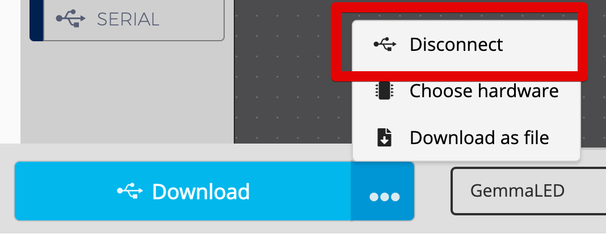
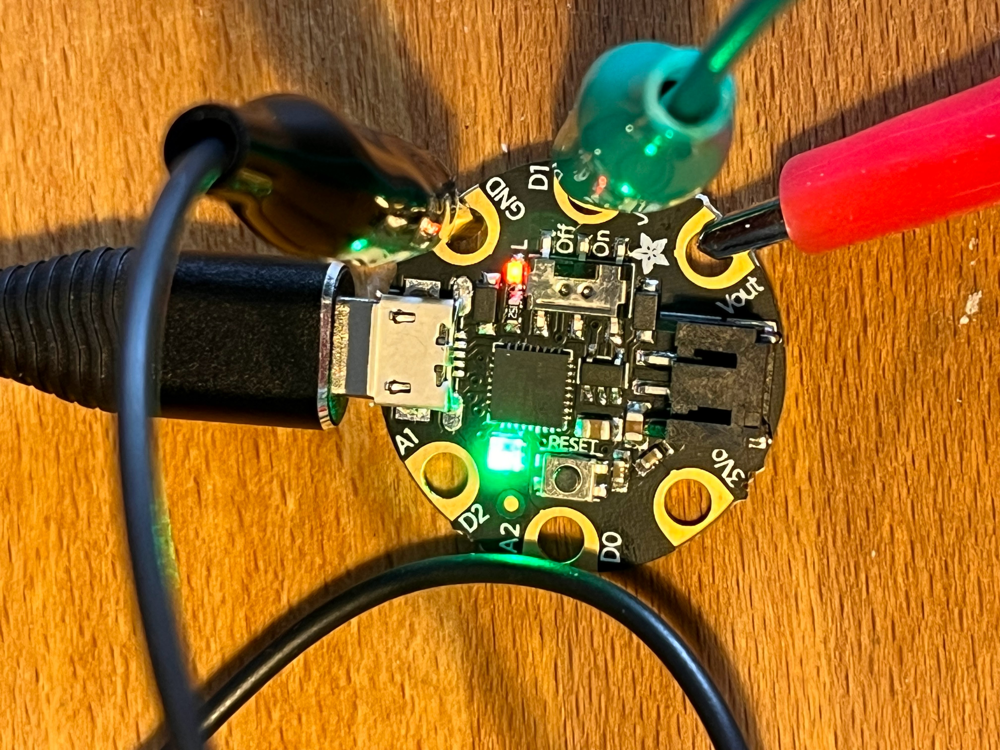
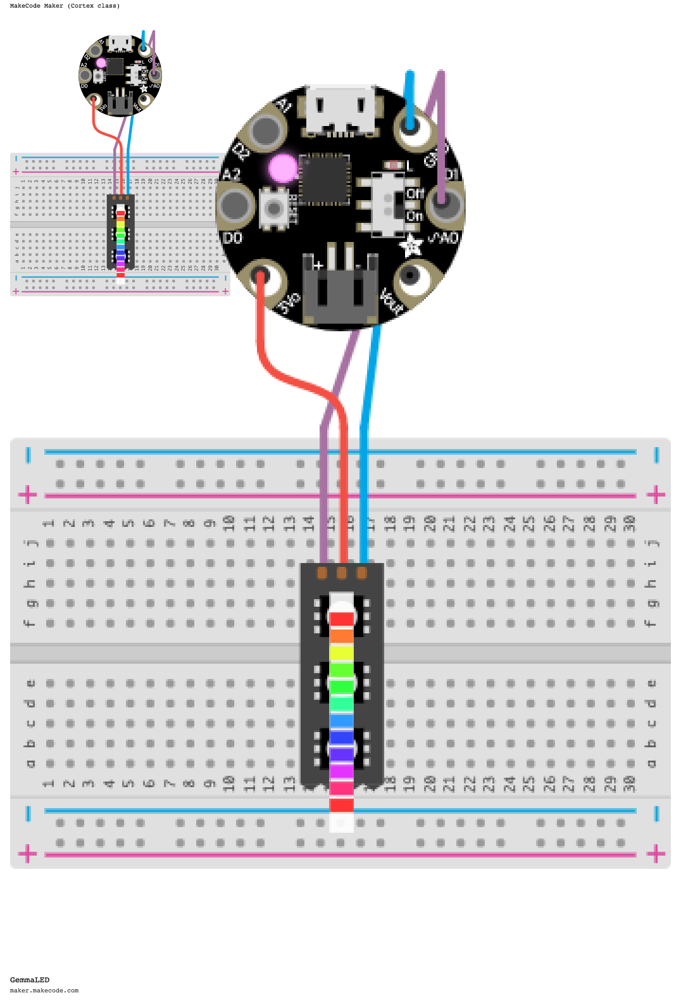

# Gemma M0

## Übersicht

## Programmieren mit MakeCode

Ein großer Vorteil ist, dass man den Gemma M0 ganz einfach mit MakeCode, der grafischen Progriammieroberfläche von Microsoft, programmieren kann.


Benutze MakeCode am besten mit dem Chrome Browser - damit kannst du die Programmierung direkt auf den Gemma übertragen, ohne vorher die U2F Datei mit dem Dateimanager kopieren zu müssen.


1. Gemma per USB anschließen
2. [https://maker.makecode.com/#editor](https://maker.makecode.com/#editor)
3. "Gemma M0" auswählen
4. 
5. Druck auf "Reset" wechselt zwischen Upload- und Running-Mode
6. 

## NeoPixel / WS1820B Anschließen

* Signal unbedingt an D1 / A0
* 

### Musik über Piezo Element

* Piezo an GND (Schwarz) und A2 (Rot) anschließen
* 
