# Konsensomat

## Was ist der Konsensomat?



## Aufbau

<figure>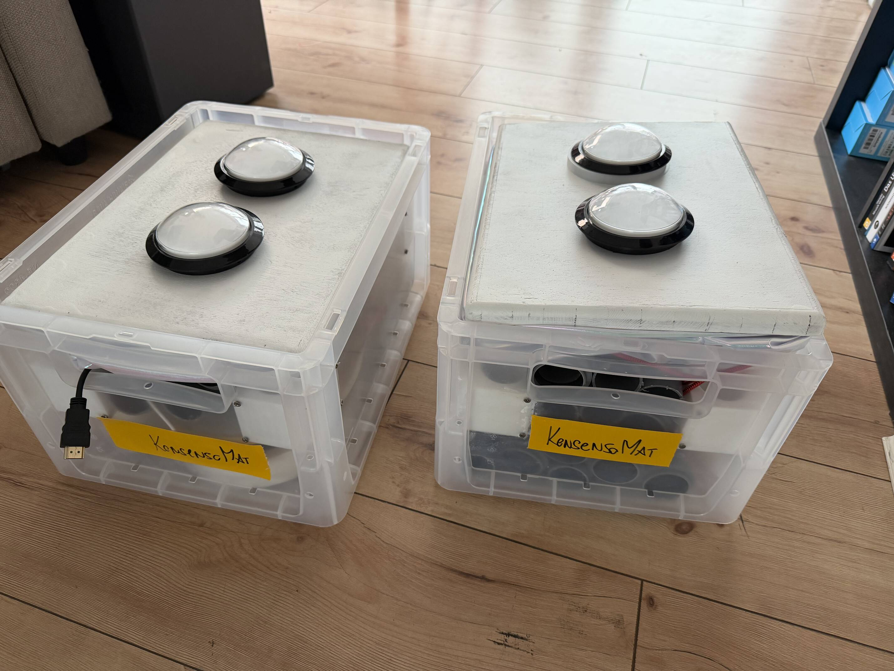<figcaption></figcaption></figure>

Der ganze Aparat ist ein 2 Kisten.&#x20;

### Aufbau Pulte

Die Rohre können ineinander gesteckt werden. jeweils 2 Lange pro Ecke zusammen. Danach noch 2 Kurze jeweils auf einer Seite.&#x20;

<figure>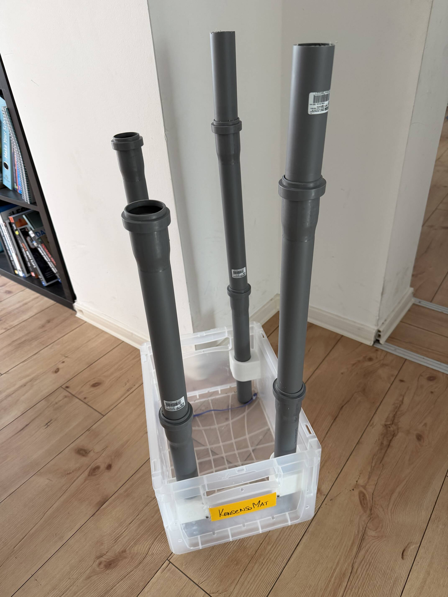<figcaption></figcaption></figure> <figure>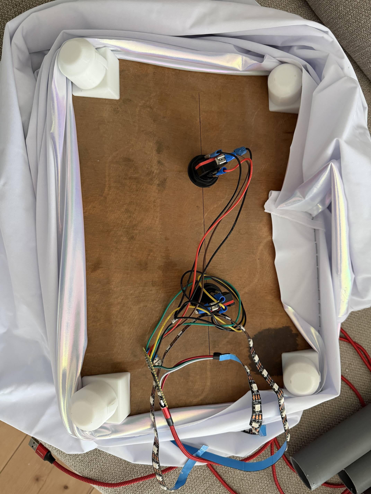<figcaption></figcaption></figure> <figure>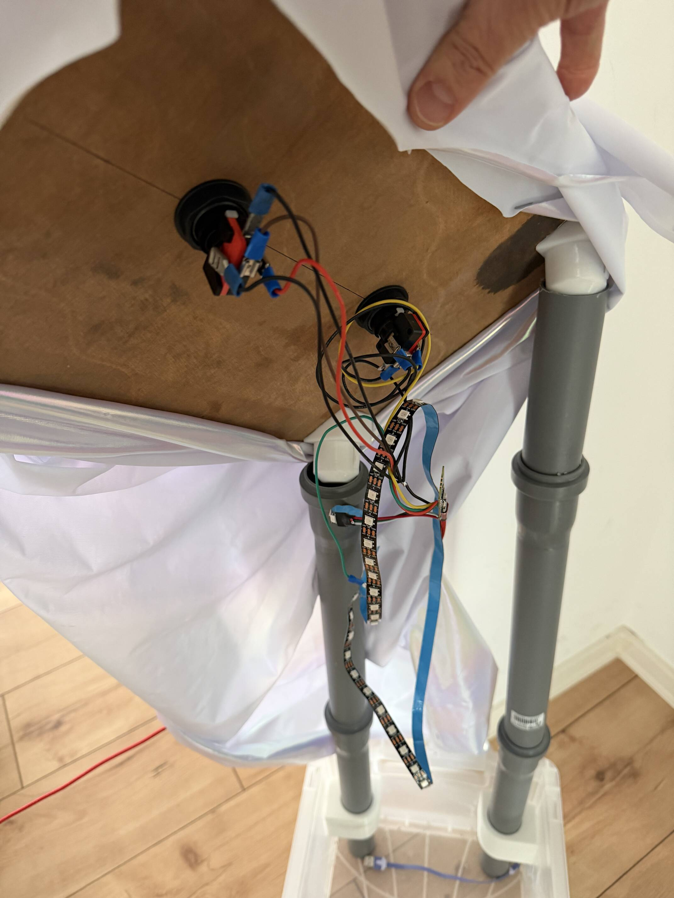<figcaption></figcaption></figure> <figure>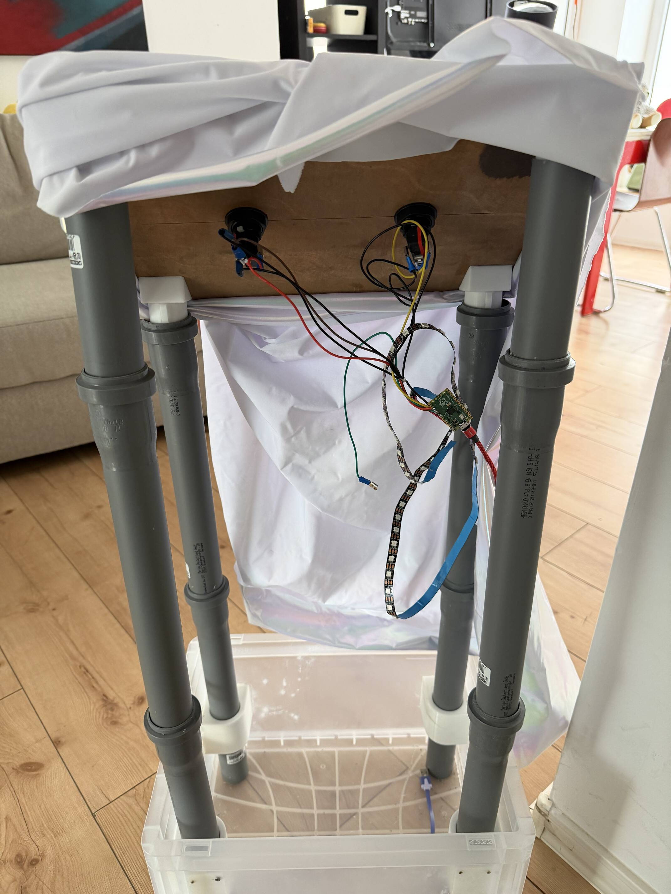<figcaption></figcaption></figure>

Für das 2. Pult genauso - die Rohre sind aber ungleich auf die Kisten verteilt :-)

### Anstecken...

<figure>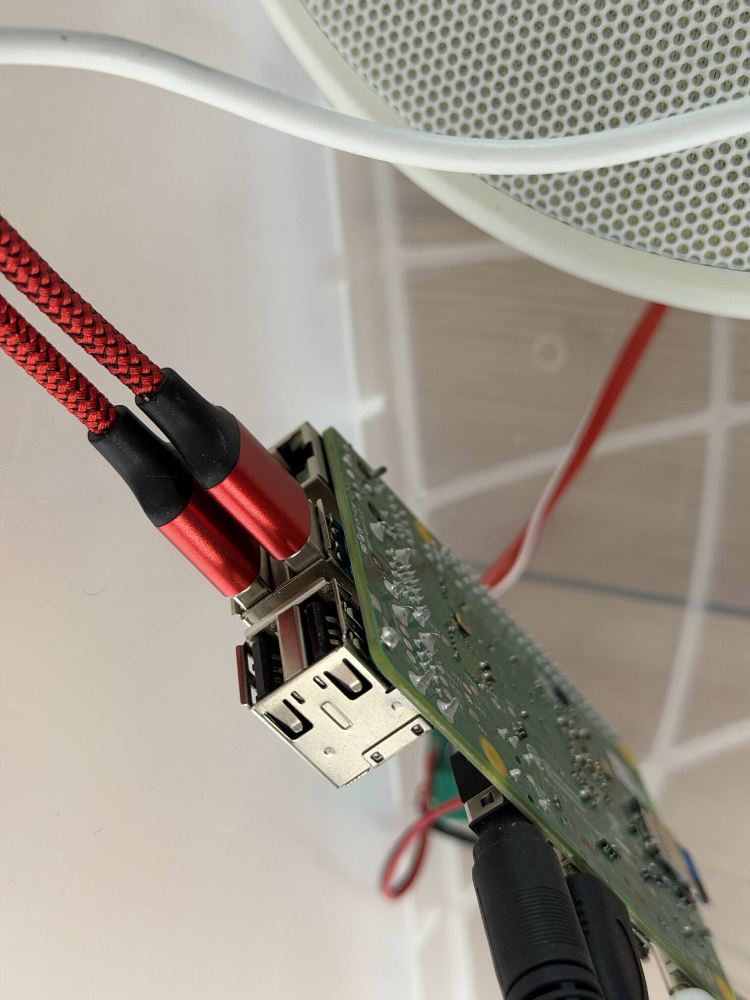<figcaption></figcaption></figure>

Den roten Stecker vom 2. Pult im Computer in der 1. Kiste einstecken.

## Übersicht&#x20;

<figure>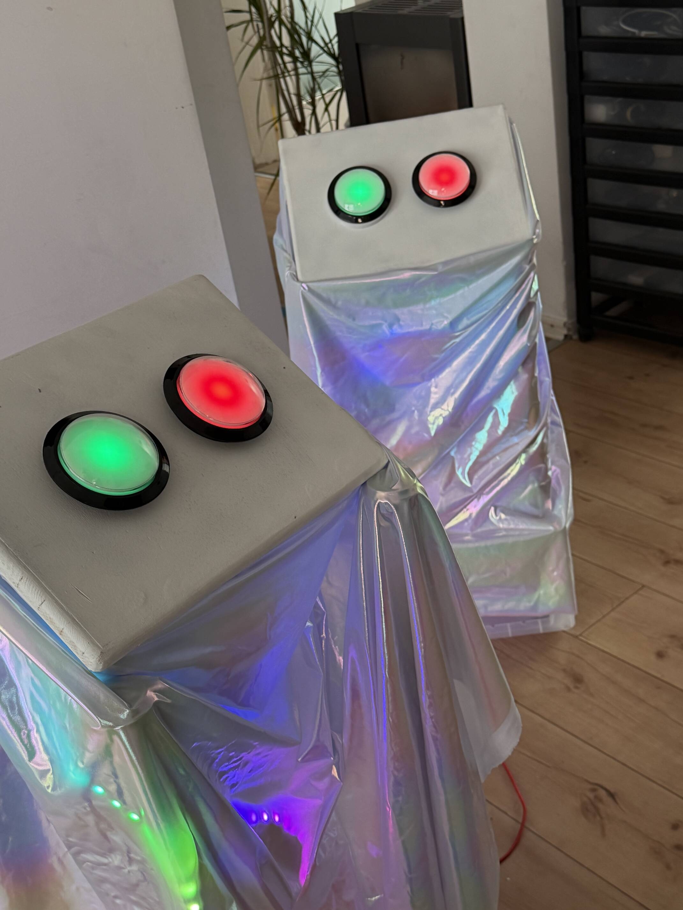<figcaption></figcaption></figure> <figure>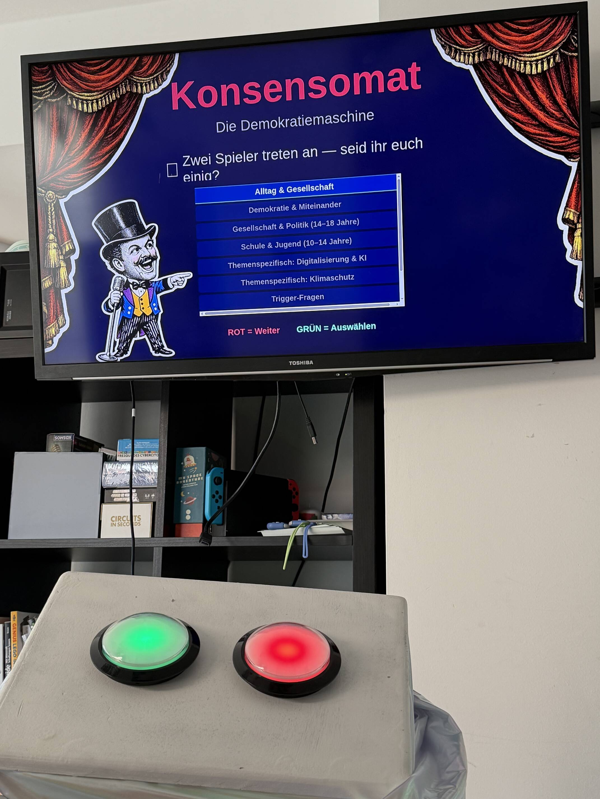<figcaption></figcaption></figure> <figure>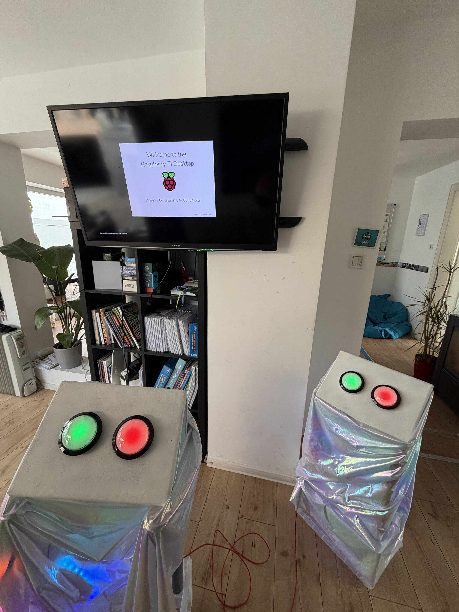<figcaption></figcaption></figure> <figure>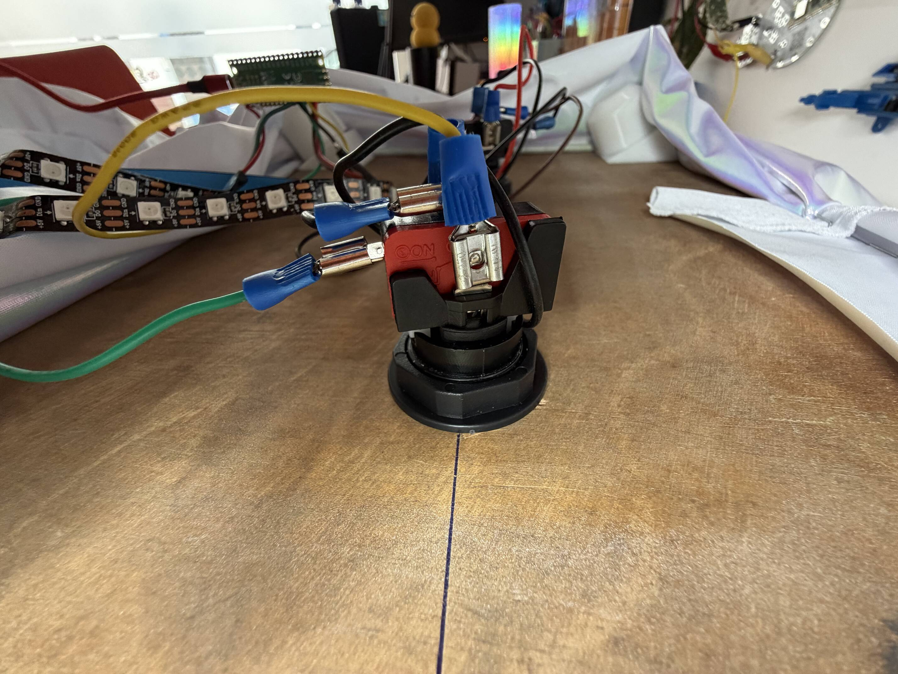<figcaption></figcaption></figure> <figure>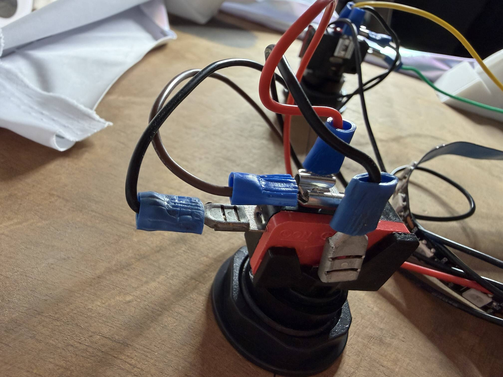<figcaption></figcaption></figure>

