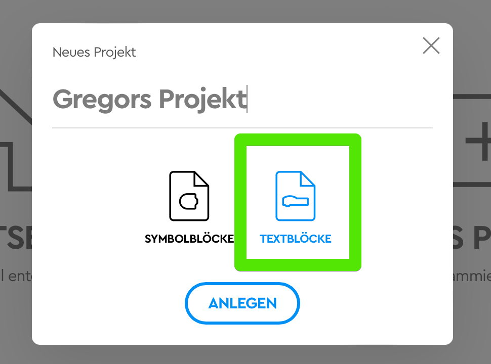

# Lego Robotic Workshop

Grundlage für den Workshop sind die Lego-Sets „[Spike Prime](https://education.lego.com/de-de/products/lego-education-spike-prime-set/45678)“.&#x20;

## Übersicht  und Ablauf

### Zielgruppe

Der Workshop eignet sich für Kinder ab der **2. Klasse bis zur 9. Klasse.**&#x20;

Bei jüngeren Teilnehmern kann der spielerische Teil ausgebaut werden (Arbeit mit der Roboter-Maus, Erzählen und Geschichten) - für höhere Klassen kann der programmier- und technische Teil erweitert und vertieft werden.

### Grundsätzliche Methoden

Es wird bei diesem Workshop stark auf [**exploratives Lernen**](https://de.wikipedia.org/wiki/Entdeckendes\_Lernen) und **gemeinsames Arbeiten** gelegt: Die komplette Bau-Phase mit den Robotern wird ohne Anleitung oder feste Vorgaben gemacht: die Kinder erkunden selbst, was sich in den Lego-Kästen befindet, probieren aus und teilen ihre Erkenntnisse mit allen. Es bauen jeweils 2–4 Kinder an einem Set, so entsteht tolles Teamwork mit verschiedenen Rollen: Es kann programmiert, gebaut und verziert werden!

Durch das freie Bauen kommt auch die **Kreativität** nicht zu kurz: schon bei der Einführung mit den Roboter-Mäusen erfinden die Kinder ihre eigenen Geschichten und verwirklichen verschiedenste Ideen im Team. Beim Bauen der Roboter werden auch individuelle Ideen der Kinder umgesetzt und das Aussehen ist immer anders und kreativ.

### Zeitlicher Ablauf

Exemplarisch an einen Workshop an einem Vormittag mit einer Schulklasse

| Zeit / Dauer           | Inhalt                                               | Methode                                                      | Bemerkung                                                              |
| ---------------------- | ---------------------------------------------------- | ------------------------------------------------------------ | ---------------------------------------------------------------------- |
| 8:00 Uhr - 30 min      | Vorstellung & Welche Roboter kennst Du?              | Stuhlkreis, gemeinsames Besprechen, Videos zum Thema         | [https://kidslab.de/roboter-videos](https://kidslab.de/roboter-videos) |
| 8:30 Uhr - 60 min      | Erste Programmierung mit der Roboter Maus            | Kreatives Gestalten & erste Programmierung                   |                                                                        |
| 9:30 Uhr - 30 min      | Lego Sets erkunden                                   | Erkunden im Team, Feeback im gemeinsamen Gespräch            |                                                                        |
| 10:00 Uhr - 60 min     | Erster Roboter Fahrzeug bauen & erste Programmierung | Freies Bauen ohne Anleitung im Team                          |                                                                        |
| 11:00 Uhr - 60 min     | Sensoren einsetzen und programmieren                 | Einfache Erklärung, dann freies Programmieren und Probieren  | Kann beliebig verlängert werden                                        |
| 12:00 Uhr - 30 Minuten | Abschluss und Aufräumen                              | Feedback Runde, zerlegen der Roboter und alles aufräumen     |                                                                        |

##

## Vorbereitung

### Was brauchst Du?

* Lego Spike Prime Sets
* iPad
* Programmier-Maus "[Robot Mouse](https://www.learningresources.com/catalog/product/view/id/4673/s/item-stem-robot-mouse/category/4678/)" _(Optional)_
  * Papier & Stifte
  * Vorlage-Quadrat (15cm Quadrat aus Karton)

### Vorbereiten der Ausstattung

* die Lego-Gehirne aufladen
* die iPads aufladen
* Lego-Spike-Software installieren
* Verbindung der iPads mit den Gehirnen testen

Es können 2–4 Kinder pro Set arbeiten.

## Ablauf

## 1. Einführung & Kennenlernen

Die Kinder setzen sich im Stuhlkreis zusammen: Am Anfang stellen sich die Mentoren und die Kinder vor:

* Jeder nennt seinen Namen und sein Alter
* Welche Roboter hättest Du gerne und was soll er für Dich machens

Danach wird in die Runde gefragt: Welche Roboter kennst Du? In dieser Playlist gibt es eine schöne Übersicht von Robotern und deren Einsatz:

* Boston Dynamics: Menschenähnliche Roboter, die sich auf 2 Beinen bewegen können, wie Menschen
* Staubsauger-Roboter: haben viele Leute zuhause. Sehr einfaches Funktionsprinzip: fährt immer, bis der Sensor vorne eine Wand entdeckt, dann dreht er um und fährt zufällig weiter. Neuere Modelle haben u.u. noch bessere und weitere Sensoren wie LIDAR etc.
* Pflegeroboter Pepper: gibt es Bedenken, beim Einsatz? Möchtest Du von einem Roboter gepflegt werden?
* Roboter-Fußall: wer kann besser Fußball spielen?
* Tischtennis-Duell: Kuka-Roboter vs. Mensch? Leider nur fake :man\_facepalming:
* ... der selbstgebaute ist aber echt!
* Gemonoid HI-1: warum macht es Sinn, Robotern ein menschliches Antlitz zu verpassen?
* Robo-Küche: Roboter servieren in China im Restaurant



Anhand der Videos können die Ideen und Vorschläge visualisiert und diskutiert werden.

* Was machen Roboter so?
  * Gefährliche, schwere Sachen (Fabrik)
  * Langweilige Sachen: saugen und rasenmähen
  *
* Was macht einen Roboter aus?
  * Sensor - Umwelt erkennen
  * Aktor - Interaktion mit der Umwelt
  * "Gehirn" - Programm, das selbständig Entscheidungen trifft - keine Fernbedienung
* Sind Roboter eine Bedrohung oder Hilfe für Menschen?
  * Wer will vom Roboter gepflegt werden?
  * Ist der menschenähnliche Roboter unheimlich?

## 2. Roboter-Mäuse - erstes Programmieren


Übersicht der Bedienung und Möglichkeiten der Roboter-Maus


<figure><figcaption>
Maus-Labyrinth
</figcaption></figure>

Die Kinder erhalten in Gruppen die Roboter-Mäuse. Im Ersten Schritt erkunden sie die Möglichkeiten der Mäuse: Welche Taste hat welche Funktion?

Die Mäuse haben 7 Tasten:

* **4 Richtungstasten**: vorwärts, rückwärts, links drehen, rechts drehen
* <mark style="color:green;">**Grün**</mark>: Programm starten
* <mark style="color:red;">**Rot**</mark>: Programm löschen
* <mark style="color:yellow;">**Gelb**</mark>: Aktion-Taste - die Maus macht Geräusche oder wackelt

Man programmiert also die Schritte, die die Maus ausführen soll - und startet dann das Programm mit der grünen Taste.


Programmier-Tipp 1: **Immer Schritt für Schritt programmieren!** Lass die Maus zur ersten Abbiegung fahren, probiere es aus! Wenn es geklappt hat, weiter zur nächsten Abbiegung!



Programmier-Tipp 2: **Beweg die Maus beim Programmieren mit!** Drücke die Vorwärts-Taste und bewege die Maus ein Feld vorwärts. So kannst Du einfach sehen was passiert und wie du weiter programmieren musst.


Nachdem die Bedienung klar ist, erhalten die Kinder ein großes Papier (Flipchart oder A2) und erstellen darauf ein Labyrinth / Hindernis-Lauf für die Maus.

Das wird dann programmiert!&#x20;


Versteckte Funktion: die Mäuse haben auch einen Sensor - versteckt in der Nase können sie Metal oder andere Mäuse-Nasen erkennen&#x20;


### Abschluss


Alle Kinder treffen sich - jede Gruppe zeigt ihre Kreation und wie die Maus das ganze meistert!


## 3. Einführung mit Lego / Erster Roboter-Fahrzeug

Auch hier steht das Entdecken und selbst-erfahren im Vordergrund: viele Kinder kennen Lego nur vom Bauen nach Anleitung. Wir geben ihnen die Möglichkeit, selbst herauszufinden, wie die einzelnen Teile funktionieren und zusammenpassen:

Jede Gruppe (2-4 Kinder) erhält einen Lego-Kasten und die Aufgabe, die einzelnen Teile und ihre Funktion zu erkunden. Nach 10-15 Minuten treffen sich alle wieder im Kreis und jede Gruppe stellt ihre Erkenntnisse vor!

<figure><figcaption>
Übersicht der Teile
</figcaption></figure>

#### Normale Bauteile

Damit lässt sich das Skelett des Roboters bauen

#### Motoren (Aktoren)

Bewegen sich und den Roboter

#### Sensoren

Nehmen die Umwelt war, damit der Roboter reagieren kann

#### Das "Gehirn"

Hier läuft das Programm ab, das den Roboter steuert

### Erstes Fahrzeug

Ein einfacher Start gelingt mit einem 3-rädrigem Roboter: er hat 2 Räder mit jeweils einem Motor - das dritte Rad ist eine Kugel, die sich in alle Richtungen drehen kann. Der Roboter lenkt also mit den beiden Motoren:

* Beide Motoren vorwärts: Roboter fährt vorwärts
* Ein Motor vorwärts, ein Motor rückwärts: der Roboter dreht
* ...


Mit einem einfachen Rahmen können die Motoren, das Gehirn und schmückende Teile miteinander verbunden werden.


Man erklärt den Kindern kurz das Prinzip und zeigt vielleicht ein Bild (auch auf der Lego-Kiste so zu sehen) - **die Kinder bauen das ganze dann selbständig im Team ohne Anleitung!**&#x20;

<figure><figcaption>
Roboter von unten
</figcaption></figure>

Wenn der Roboter fertig ist, verbindet man die Gehirne mit dem iPad:

1. iPads anschalten und "Spike" App öffnen, "**Spike Prime"** wählen&#x20;
2.  Neues Projekt anlegen - Block&#x20;

    <figure><figcaption></figcaption></figure>
3.  Verbinden...

    <figure><figcaption></figcaption></figure>

4.  Gehirn aktivieren

    <figure><figcaption>
Anweisungen in der App befolgen
</figcaption></figure>

5.  Fertig!

    <figure><figcaption>
Verrbindung abgeschlossen: man sieht die angeschlossenen Teile
</figcaption></figure>

### Erstes Programm: Abgefahren!

<figure><figcaption>
Erstes Programm
</figcaption></figure>


Los gehts! Mit diesem einfachen Programm fährt der Roboter 10 cm gerade aus! Jetzt ist es an den Kindern, das Programm anzupassen, damit der Roboter andere Muster ausführt..!


## 4. Roboter reagiert auf die Umwelt: Einsatz und Programmierung der Sensoren

Als Nächstes wird der erste Sensor eingesetzt: Wir nehmen den Abstandssensor und benutzen ihn, um den Roboter Hindernissen ausweichen zu lassen.


**Funktioniert der Sensor?**

Beim Status des Gehirns sieht man im Detail, welche Sensoren und Aktoren angeschlossen sind und was für Werte sie liefern: hier "sieht" der Abstandssensor ein Hinterniss mit 45 cm Abstand



Der Abstands-Sensor wird vorne auf unseren bestehenden Roboter gesetzt und mit dem Gehirn verbunden.

<figure><figcaption>
Hier ist der Abstandssensor verbaut
</figcaption></figure>

<figure><figcaption>
Einfaches Ausweichprogramm
</figcaption></figure>

## 5. Abschluss und Abbau

Am Ende treffen sich alle noch mal im Kreis: was habt ihr heute gelernt? Hat es Spaß gemacht?


Leider müssen die Roboter wieder zerlegt werden und die Kästen für die Nächsten Kinder vorbereiten werden - bitte wieder ordentlich zurückräumen und keine Teile zwischen den Kästen tauschen!


## Fehlerbehebung & Tipps

### App reagiert nicht mehr

Spike App schließen:

* Doppelklick auf Home-Button
* App nach „oben wegschieben.“

Neu starten.

### Verbindungsprobleme

Manchmal kann es sein, dass die iPads sich nicht mit den Gehirnen verbinden:

*

    Spike App schließen&#x20;

    * Doppelklick auf Home-Button
    * App nach „oben wegschieben.“
* „**Einstellungen**“ öffnen auf iPad
* Bluetooth - Gerät wählen und auf (i) klicken und **„Dieses Gerät ignorieren.“**

