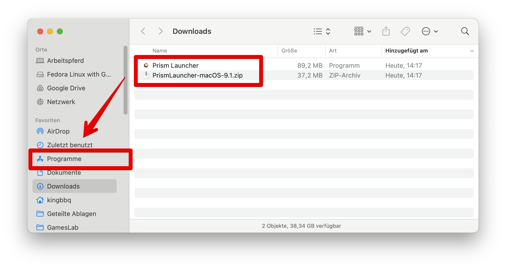
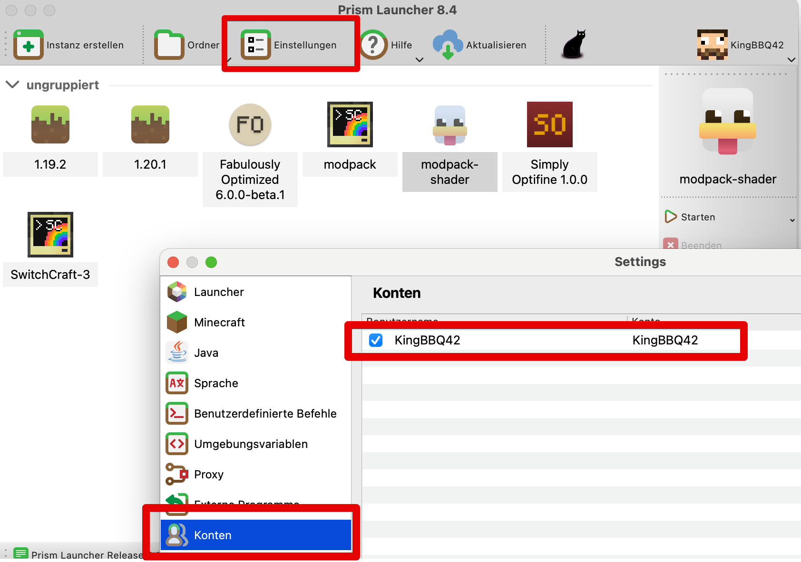
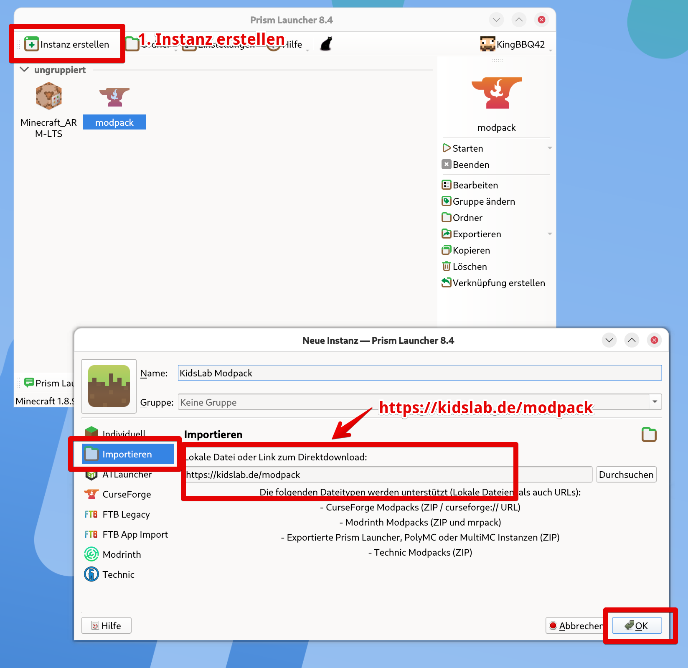

# Installation Apple Silicon M1 etc.

Auf manchen Apple MacBooks mit den aktuellen M-Prozessoren gibt es manchmal Probleme bei der Installation. Wir empfehlen in diesem Fall die Benutzung des **Prism-Launchers.**

So gehts:

1. Prism Launcher herunterladen:
   1. [https://prismlauncher.org/download/mac/](https://prismlauncher.org/download/mac/)
2. Entpacken - &#x44;_&#x6F;ppelklick_ auf die ZIP Datei
3. Mit Drag\&Drop zu **`Programme`** verschieben
4. Starten
5. Unter **`Einstellungen`** den Minecraft Account hinterlegen
6. Klicke auf &#x49;**`nstanz erstellen`** und auf **`Importieren`**
7. Gib unter Download-Link ein:
   1. https://kidslab.de/modpack

Danach kann der Modpack wie im ATLauncher gestartet werden.

<figure><figcaption>
Programm entpacken und in Programme verschieben
</figcaption></figure>

<figure><figcaption>
Unter Einstellungen den Minecraft-Account hinzufügen
</figcaption></figure>

<figure><figcaption></figcaption></figure>
