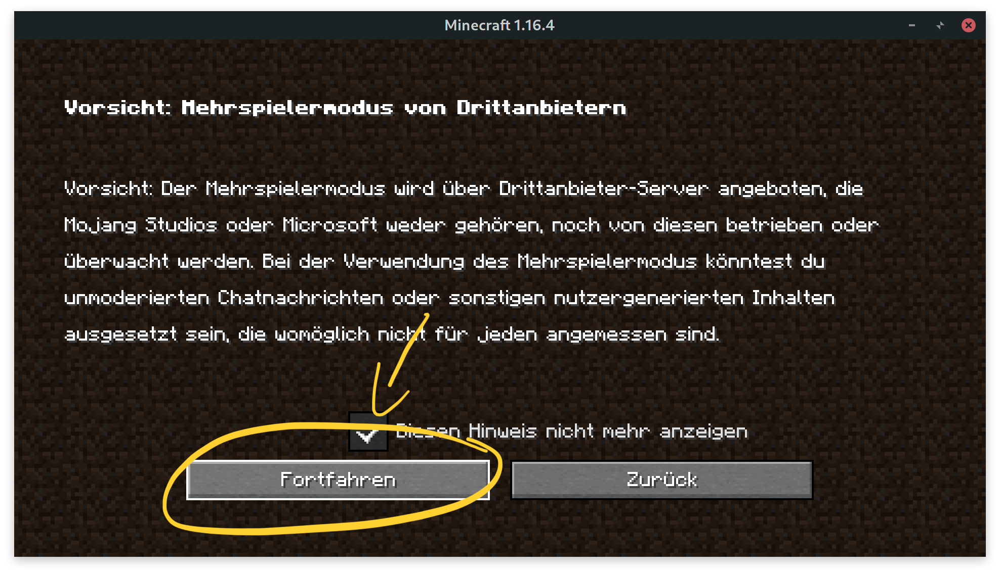

# Installation Minecraft Java allgemein

## Herunterladen der Java-Version


Verwirrt von den verschiedenen Version? Hier eine kleine [Übersicht](minecraft-versionen.md). 


Lade den Installer für die Minecraft Java Version hier herunter:



Nach der Installation musst Du Dich erst mal anmelden:


Mehr über den Unterschied zwischen Mohjang und Microsoft-Konten findest Du hier: [Minecraft Konten](minecraft-und-microsoft-konten.md)



Du hast keine Java-Lizenz? Gerne stelle ich eine Version für die Dauer des Kurses zur Verfügung.


Nach der Anmeldung und dem Start auf **"Spielen"** klicken:

## Server Anlegen und beitreten

Nach dem anmelden und start musst Du nur noch den Server anlegen:

* Klicke auf "**Mehrspieler**"
* Die Warnung mit "**Fortfahren**" bestätigen
* Klicke auf "**Server hinzufügen**"
  * Servername: "Stadt der Zukunft"
  * Serveradresse: **server.kidslab.de**
  * "**Fertig**" zum bestätigen
* Server auswählen
* **"Server beitreten"**  


Du siehst jetzt eine leere Welt? **Geschafft**! 

**Du kannst nichts abbauen oder machen**? Das ist richtig so - diese Welt ist nur zum testen da!


