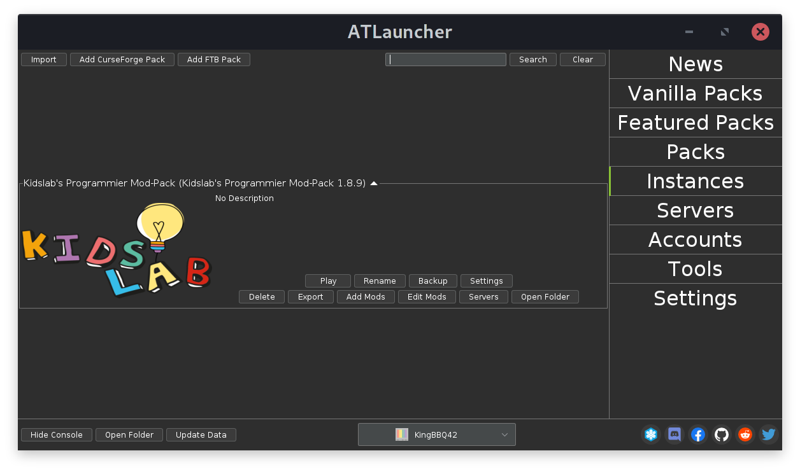
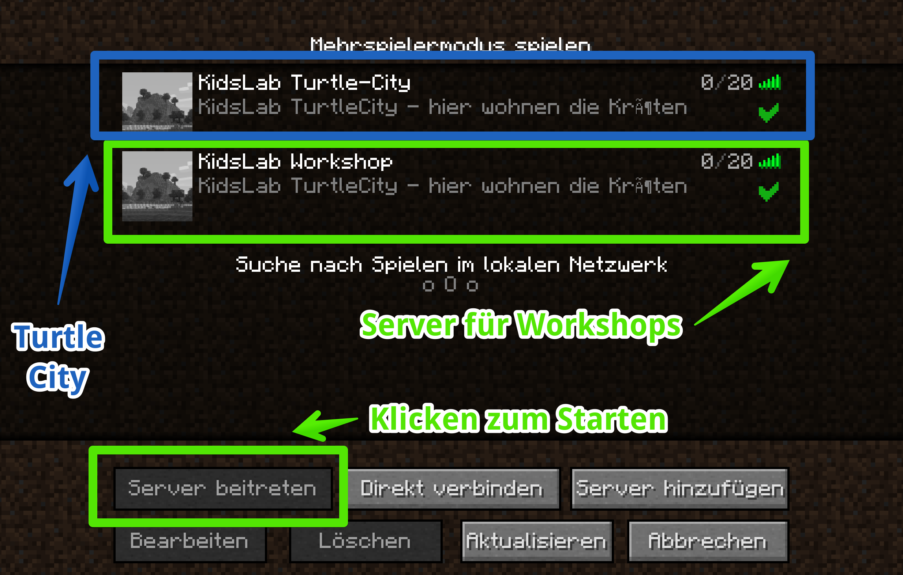
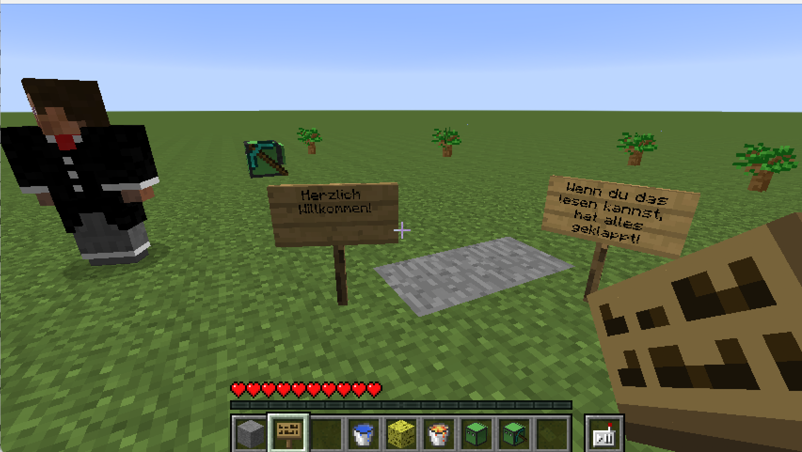

# Installation ModPack

## Minecraft-Java Lizenz

Zum Spielen benötigst Du eine Lizenz für die "Minecraft Java Edition".


Solltest Du keine Minecraft-Lizenz haben - sag Bescheid, ich kann Dir für die Dauer des Kurses eine meiner Lizenzen geben. **Empfehlung ist eine eigene Lizenz, um auch noch dem Kurs selber weitermachen zu können - die gibt es hier für 24 €:** [**Minecraft-Java**](https://www.minecraft.net/de-de/store/minecraft-java-edition)\*\*\*\*


Wenn deine **Java-Version mit einem Microsoft-Account** verknüpft ist, und dieses Konto ein "Kinderkonto" ist, gibt es noch ein paar zusätzliche Sachen zu beachten - mehr findest du auf dieser Seite: [Minecraft und Microsoft Konten](minecraft-und-microsoft-konten.md)


Tablets, Playstation oder ähnliche Geräte gehen leider nicht! Diese Versionen sind untereinander leider nicht kompatibel


## AtLauncher Installation

Ich habe alles in einem ModPack zusammengestellt. Im Folgenden erkläre ich Dir, wie man dieses installieren kann.

### Installation Windows

1. **AtLauncher hier runterladen:** [https://atlauncher.com/download/exe-setup](https://atlauncher.com/download/exe-setup)
2. **Setup ausführen** \(Doppelklick auf Datei im Downloads Ordner\)
3. **AtLauncher starten**
4. Rechts "**Accounts**" auswählen
   1. Mohjang Account? \(Vor 2021 gekauft\) - Username und Password eintragen
   2. Microsoft Account? Auf "Login with Microsoft" klicken und anmelden
5. Rechts "**Instances**" auswählen
6. Links oben auf "**Import**" klicken
7. Folgende **URL** eintippen oder einfügen: [https://kidslab.de/modpack](https://kidslab.de/modpack)
8. Fertig! 



### **Installation MacOS**

1. Zuerst **Java installieren**: [https://java.com/de/download/](https://java.com/de/download/)
2. Dann **AtLauncher für Mac herunterladen:** [https://atlauncher.com/download/zip](https://atlauncher.com/download/zip)
3. Das landet im Downoads-Ordner - ein **Doppelklick auf die ZIP Datei** entpackt die Applikation.
4. Mit Drag&Drop in den Ordner "**Programme**" **verschieben**
5. Beim ersten Start zusätzlich die **CTRL / Control taste gedrückt halten - und dann "Öffnen" klicken**
6. Rechts "**Accounts**" auswählen
   1. Mohjang Account? \(Vor 2021 gekauft\) - Username und Password eintragen
   2. Microsoft Account? Auf "Login with Microsoft" klicken und anmelden
7. Rechts "**Instances**" auswählen
8. Links oben auf "**Import**" klicken
9. Folgende URL eintippen oder einfügen: [https://kidslab.de/modpack](https://kidslab.de/modpack)
10. Fertig! 



## Erster Start

Wenn alles installiert und eingerichtet ist, starte bitte den AtLauncher und wechsle auf den Reiter "**Instances**" \(rechts\):

Klicke jetzt auf den Knopf "**Play**" beim KidsLab-Modpack.

### Verbinden zum Server

Sieht dein Screen jetzt so aus? Super!

Es sind 2 Server in der Liste, klicke bitte auf einer der beiden Server \(grün wenn aktiv\) und dann unten auf "**Server beitreten**"


Es gibt 2 Server:

**KidsLab Workshop**: Auf diesem Server treffen wir uns zu unseren Workshops. Der Server ist nur immer für die Zeit des Workshops aktiv.

[**Kidslab Turtle City**](../turtlecity.md): ist ein Server, der immer läuft. Hier kannst Du auch außerhalb des Kurses Programmieren und die die Programme und Werke anderer anschauen.



Geschafft, du bist online!

Die Welt ist komplett leer - sie ist nur für den ersten Test da. Du kannst auch nichts machen.


Alles weitere machen wir dann im Kurs!


Fragen, Probleme? eMail an gregor@kidslab.de oder Telefon oder WhatsApp: 0821-58920484


