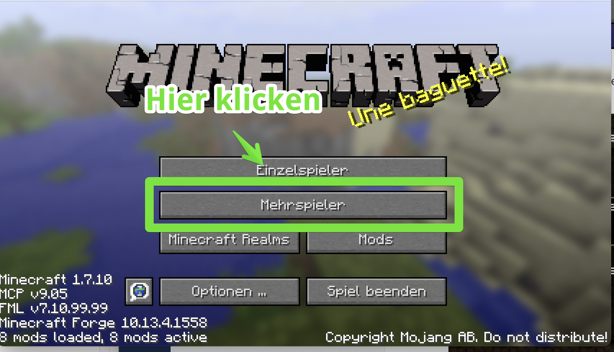

# Installation ModPack

### Die richtige Minecraft-Version und Mods installieren

Um in Minecraft Programmieren zu können, benötigt man eine spezielle Minecraft-Version und auch ein paar "Mods" \(Erweiterungen von Minecraft.\)

Zum spielen benötigt ihr die "Minecraft Java Edition". Die gibts hier für 24 €, wenn ihr sie noch nicht habt**:** [**https://www.minecraft.net/de-de/store/minecraft-java-edition**](https://www.minecraft.net/de-de/store/minecraft-java-edition)


Solltest Du keine Minecraft-Lizenz haben - sag Bescheid, ich kann Dir für die Dauer des Kurses eine meiner Lizenzen geben. **Empfehlung ist eine eigene Lizenz, um auch noch dem Kurs selber weitermachen zu können** 


Wenn deine **Java-Version mit einem Microsoft-Account** verknüpft ist, und dieses Konto ein "Kinderkonto" ist, gibt es noch ein paar zusätzliche Sachen zu beachten - mehr findest du auf dieser Seite: [Minecraft und Microsoft Konten](minecraft-und-microsoft-konten.md)


Tablets, Playstation oder ähnliche Geräte gehen leider nicht! Diese Versionen sind untereinander leider nicht kompatibel


## AtLauncher Installation

Ich habe alles in einem ModPack zusammengestellt. Im Folgenden Video erkläre ich Dir, wie man dieses installieren kann.



### AtLauncher Download

Und hier gehts zum Download: [https://atlauncher.com/downloads](https://atlauncher.com/downloads)

### ModPack-Import Adresse

Die Adresse, die du unter "Instances" im Import-Dialog eingeben musst: [https://kidslab.de/modpack](https://kidslab.de/modpack)

### **MacOS statt Windows?**



### Verbinden zum Server

Wenn du die richtige Minecraft Version installiert hast, solltest du das sehen:

Sieht dein Screen jetzt so aus? Super!

Es sind 2 Server in der Liste, klicke bitte auf den aktiven \(grün\) Server \(KidsLab oder KidsLab alternativ\) und dann unten auf "**Server beitreten**"


Geschafft, du bist online!


Die Welt ist komplett leer - sie ist nur für den ersten Test da. Du kannst auch nichts machen.

Alles weitere machen wir dann im Kurs!


Fragen, Probleme? eMail an gregor@kidslab.de oder Telefon oder WhatsApp: 0821-58920484


