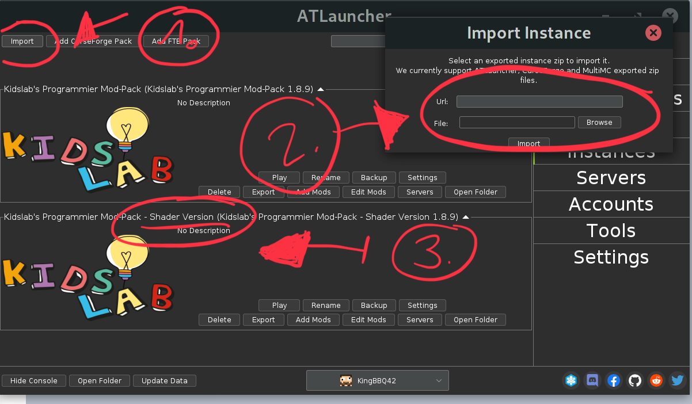
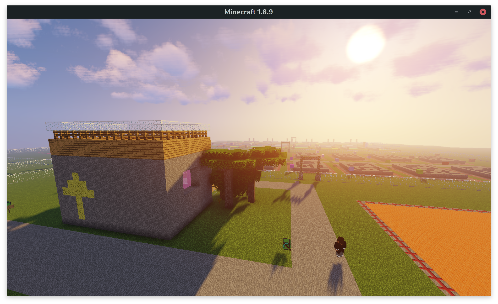

# Minecraft Shader

Ich habe für Dich eine extra Version des[ Kidslab-Modpacks](installation.md) vorbereitet, da ist der Shader bereits mit drin.

Die Installation ist super einfach, wenn du die AtLauncher bereits installiert hast. Starte den AtLauncher und gehe auf den Bereich "Instances":

1. Klicke auf "**Import**" (links oben)
2. Gib folgende URL ein: [`https://kidslab.de/modpack-shader`](https://kidslab.de/modpack-shader)\`\`
3. Nach der Installation findest Du die Version mit dem Zusatz "Shader Version"

Starten und losgeht :-)

