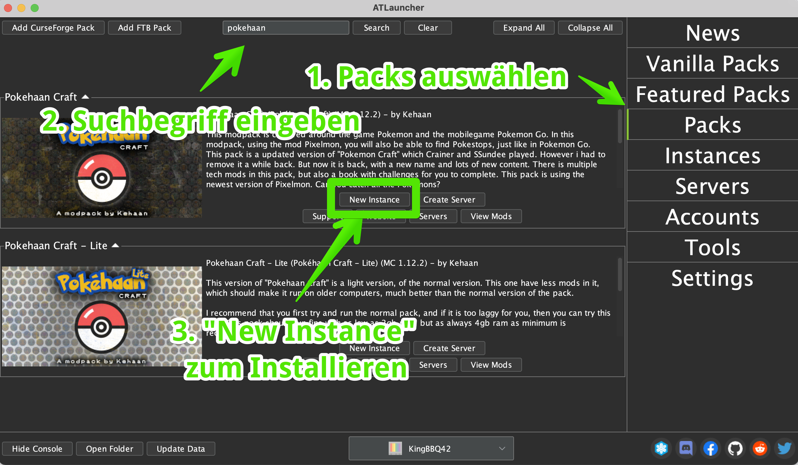
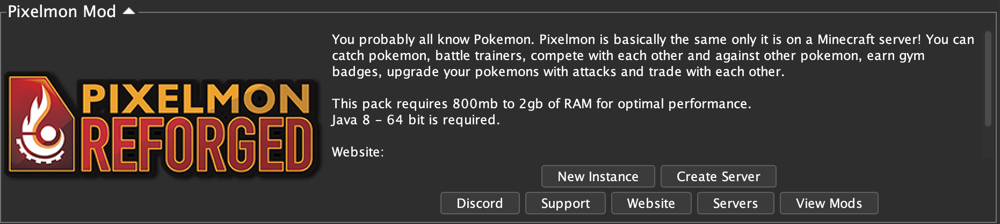

# Modpacks in ATLauncher

Im AtLauncher kann man sehr einfach neue ModPacks installieren. Mods und ModPacks sind das eigentliche Juwel in Minecraft \(Java\): kostenlose Erweiterungen, die aus deinem Minecraft eine Raketenstartbasis, eine Pokemon-Spiel oder ein Harry-Pooter Abenteuer machen!

Die Installation geht mit diesen einfachen Schritten:

1. Wechsle auf "Packs" 
2. Gib einen Suchbegriff ein und klicke auf "Search"
3. Klicke auf "New Instance"

Den ganzen Rest, Installieren, Entpacken etc. übernimmt der AtLauncher für Dich!

## Coole ModPacks

### PixelMon - Pokemon in Minecraft

