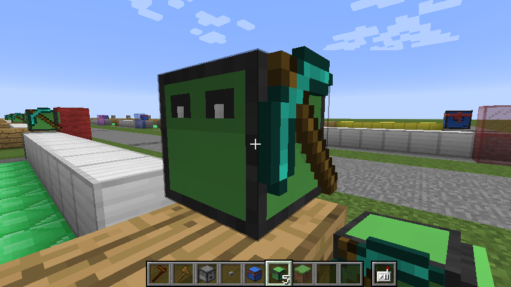

# Erste Schritte mit Robokröti

Die Mod wurde vor vielen Jahren entwickelt, von [Daniel Ratcliffe](https://github.com/dan200). 



## Fernbedienung

Um eine Schildkröte bedienen zu können, benötigst Du eine Fernbedienung.

