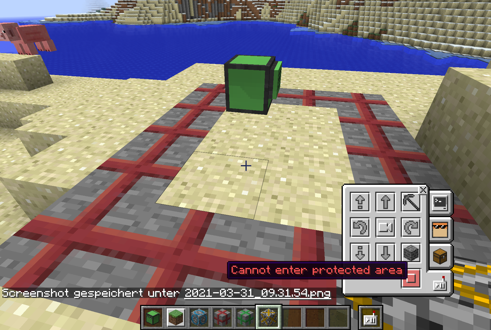

# Spezielle Blöcke für Robokröti

```text
ComputerCraftEdu:turtleBuildAllow
ComputerCraftEdu:turtleBorder
ComputerCraftEdu:turtleAntiBorder
ComputerCraftEdu:turtleBuildDisallow
```


Diese Blöcke sind nicht über das Inventar abrufbar, sondern müssen über ein /give Kommando geholt werden


```text
/give PlayerName ComputerCraftEdu:turtleBorder
```



