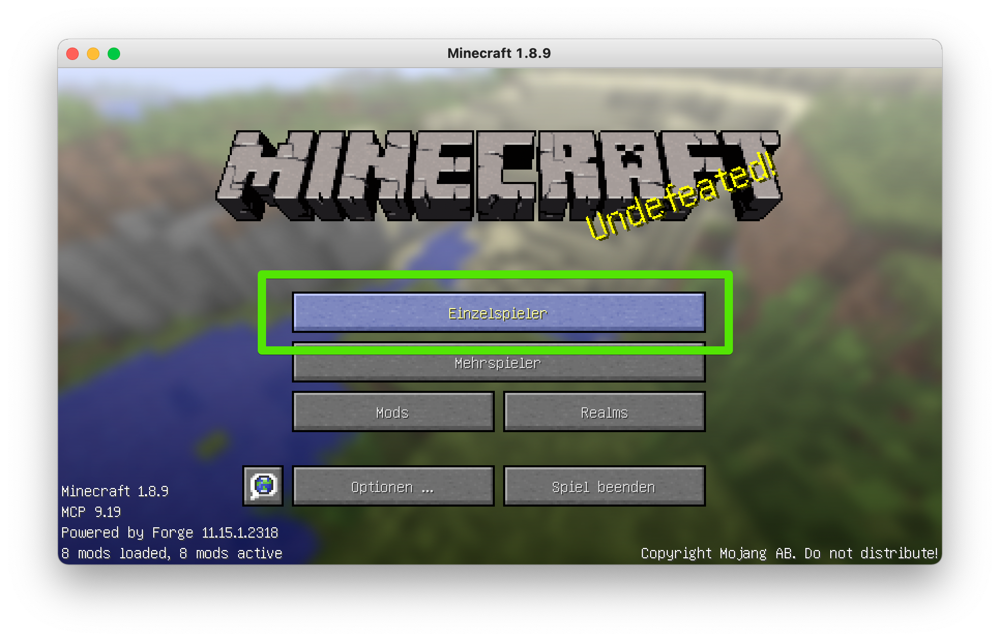
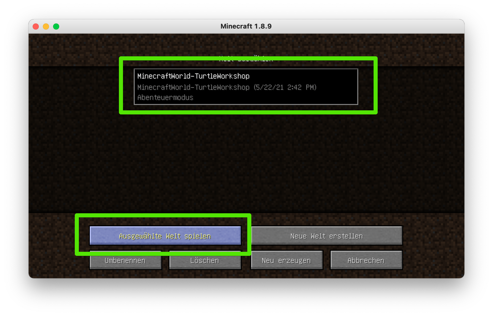

# Offline spielen (Einzelspieler)

Du kannst natürlich auch offline, das heißt alleine, mit der Schildkröte programmieren und spielen.

Dazu starte den Kidslab-Modpack und wähle "Einzelspieler":

Es gibt eine vorgefertigte Welt, in der die Aufgaben, die wir in den Kursen machen, auch vorhanden sind. Du kannst dier in Ruhe alles ausprobieren und testen, wähle dazu dann die "TurtleWorkshop". Hier bist Du auch im Abenteuer-Modus.

Oder du erstellst Dir eine eigene Welt - in Kreativ-Modus hast du dann alle möglichkeiten und kannst machen was du willst :-)

.png)

Die Schildkröten findest du im Inventar dann auf der 2. Seite

\(1\).png)
