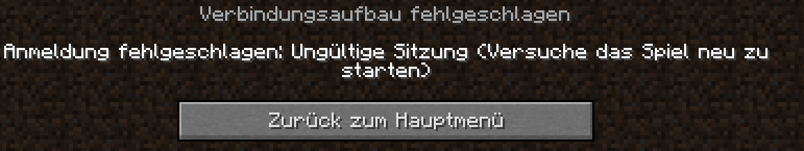
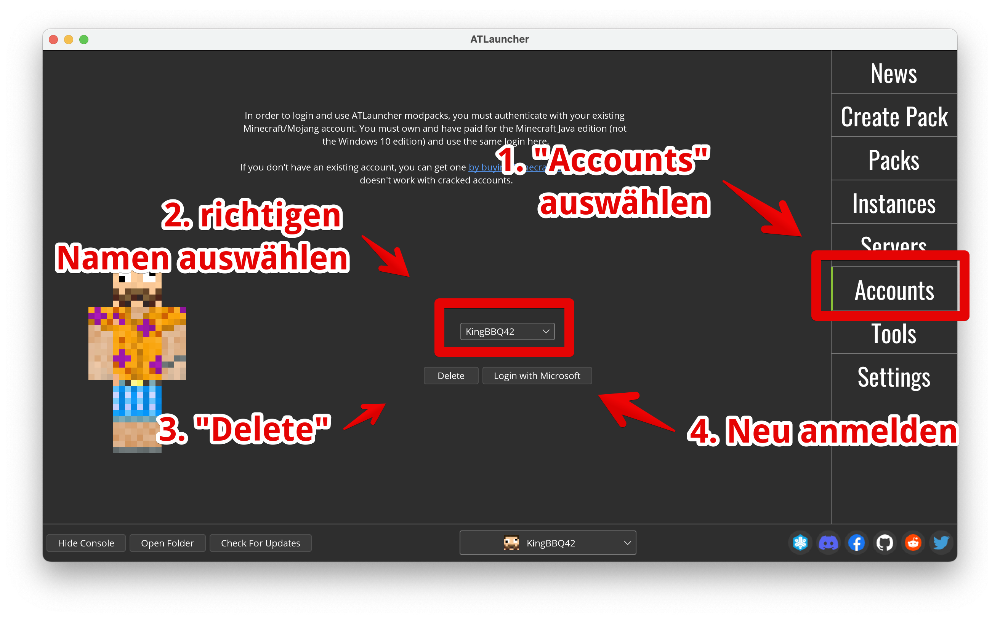

# Probleme & Lösungen

## Anmeldung fehlgeschlagen: ungültige Sitzung

Beim Anmelden auf einem Server kann es vorkommen, dass die Anmeldung bei Microsoft "abgelaufen" ist. Dann erscheint die Fehlermeldung wie unten.

<figure><figcaption></figcaption></figure>

Es reicht leider meistens nicht, wie beschrieben das Spiel neu zu starten. Stattdessen muss man den Account im ATLauncher löschen und sich neu anmelden:

<figure><figcaption></figcaption></figure>

1. Wähle **"Accounts"**
2. Wähle deinen Account-Namen im **Drop-Down**
3. Lösche die Anmeldung mit dem Knopf **"Delete"**
4. Klicke **"Login with Microsoft",** um sich neu anzumelden.

## "You Must Login Again"


Beim Start des ModPacks erscheint die Fehlermeldund "You Must Login Again" - dies kann durch ein Update des ATLaunchers manchmal passieren.

Folgende Schritte beheben diesen Fehler:

1. Wechsle auf den Reiter **„Accounts“**
2. Klicke auf die Schaltfläche „**Login wich** Microsoft.""
3. Melde Dich nochmals mit Deinem Microsoft Account an.
4. Es erscheint die Meldung:
5. ```
   Login complete. You can now close this window and go back to ATLauncher
   ```

### Fehlermeldung „Error Logging in“

Es kann passieren, dass der Login nicht klappt und auf der Webseite nach dem Anmelden diese Fehlermeldung steht:


Wenn das passiert, sich am besten im Browser aus dem Microsoft Account **abmelden**

1. Zum Abmelden auf rufe folgenden Link auf: [https://login.live.com/logout.srf](https://login.live.com/logout.srf)
2. Nachdem Du abgemeldet bist, wiederhole die Schritte zum Anmelden im ATLauncher:
   1. Wechsle zum Reiter "Accounts"
   2. Melde Dich über "Login with Microsoft" erneut an
   3. Er erscheint die Meldung: "Login complete"



