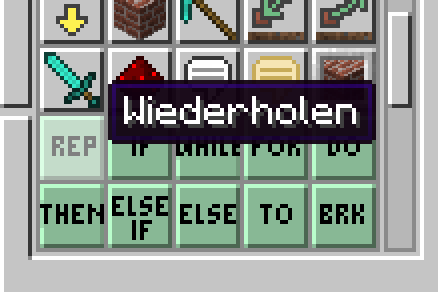
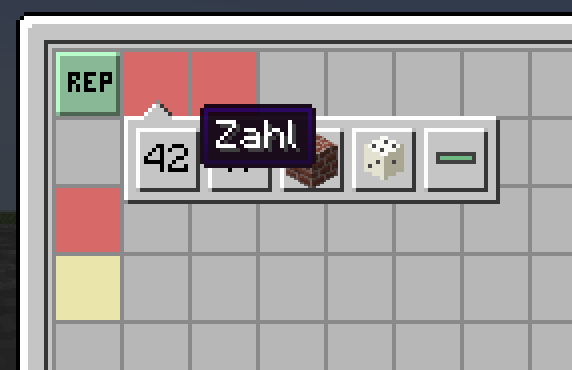
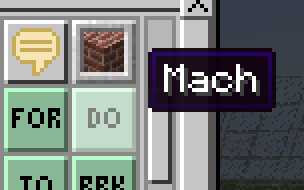
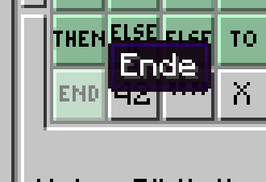
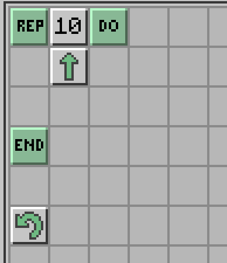
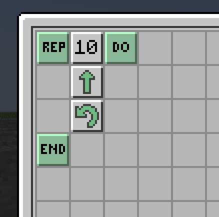

# Einführung

Schleifen werden mit dem Befehl "REPEAT" Programmiert. Den findest Du hier:

Wenn Du den Befehl in dein Programm ziehst, erscheinen mehrere rote Felder:

Mit den roten Feldern sagt Dir die Programmieroberfläche, dass noch etwas fehlt. In dem Fall von einer Schleife, muss der Computer wissen:

1. **Wie oft** er etwas wiederholen soll
2. **Was** er denn genau wiederholen soll 


Wenn du auf ein **rotes Feld** klickst, schlägt der der Computer passende Felder vor, die an dieser Stelle Sinn machen


Für ein einfaches Beispiel wählst Du **Zahl** und kannst dann die Anzahl der Wiederholungen eintippen.

Um jetzt noch festzulegen, was wiederholt werden muss, erstellen wir einen **DO / END** Block. In diesem Block steht der Code, der wiederholt wird.

Hier jetzt 2 Beispiele - die selben Blöcke nur in verschiedener Reihenfolge:


In diesem Programm geht die Schildkröte **10x vor** und **dreht sich dann 1x**



In diesem Programm geht die Schildkröte vor und dreht sich - 10 mal. **Also 10 mal vorwärts** und **10 mal drehen.**


