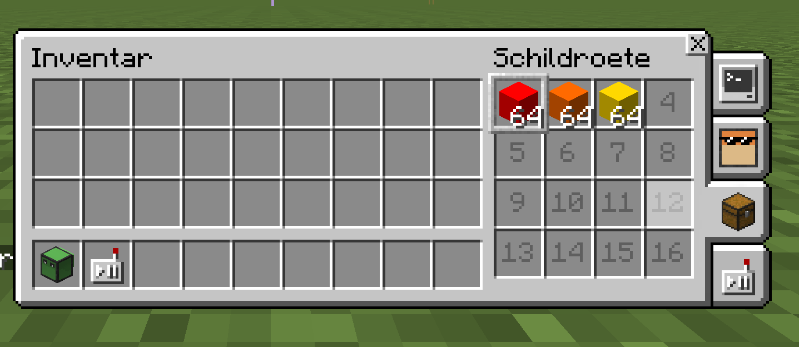
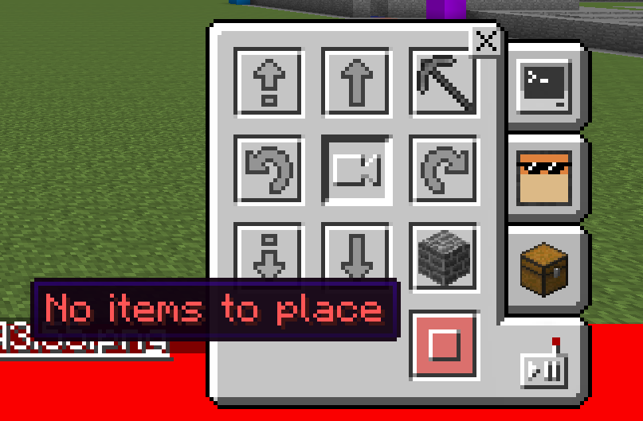
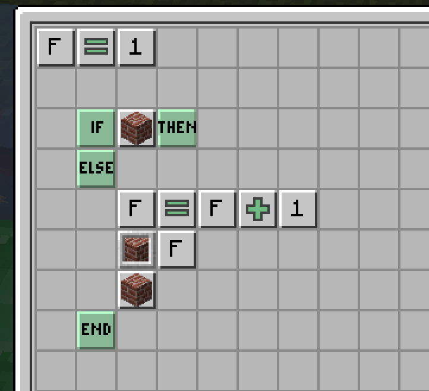

# Automatisches Wechseln des Inventars

Pro Inventarplatz können ja 64 Blöcke gesetzt werden:

Wenn Du jetzt den normalen "Platziere" Befehl verwendest, kann es passieren, dass ein Inventar-Platz leer wird. Das führt zu folgender Fehlermeldung:

Um diesen Fehler zu beheben, musst du also den Inventar-Platz wechseln. Hier findest du ein Beispiel, für ein [Unterprogramm](../programme-and-disketten/unterprogramme.md), das dies automatisch für Dich erledigt:

