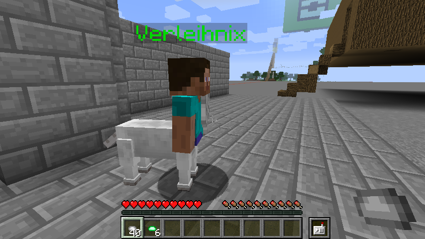
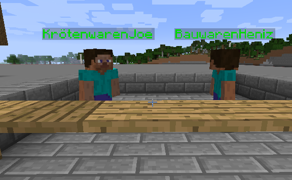
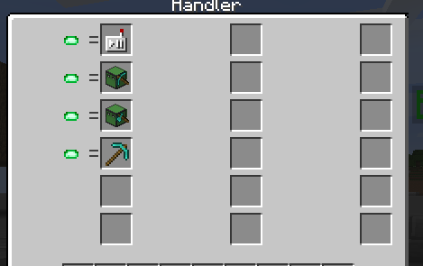
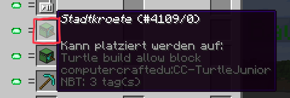
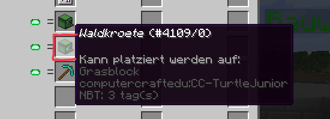
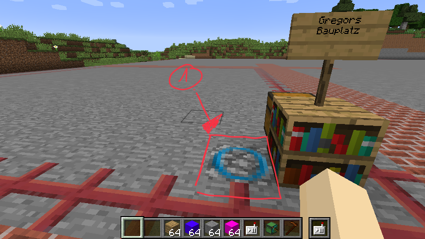

# TurtleCity

Die TurtleCity ist eine Stadt, die von den Schildkröten selbst gebaut wurde, nachdem Sie zum ersten mal in Minecraft aufgetaucht sind.

Die Stadt selbst läuft im Abenteuer Modus. Du kannst also selbst nicht bauen oder abbauen - aber die Schildkröten natürlich!

## Wie bekomme ich Kröten und alles was ich brauche?

Am Eingang erwartet dich "Verleihnix" - der versorgt Dich erst mal mit etwas Geld - damit kannst Du Dir dann alles weitere besorgen: Du bekommst 64x Silbermünzen und 64x Smaragdmünzen. Das ist für einen Tag, wenn Du morgen wiederkommst, drückt Dir der liebe Verleihnix gleich wieder den gleichen Betrag in die Hand!

Mit dem Geld kannst Du dann bei den beiden Ladeninhabern nach Herzenslust einkaufen: 

KrötenwarenJoe gibt Dir alles was mit Kröten und Fernbedienungen etc. zu tun hat!

Es gibt 2 verschiedene Kröten:

### Stadtkröte - die Kröte zum Programmieren und Bauen in der Stadt

### Waldkröte - für alles außerhalb der Stadt

Es gibt auch eine spezielle Hacke - mit der kannst du Kröten und die Blöcke, die für das Bauen in der Stadt gedacht sind, abbauen.


Abgebaute Schildkröten können nicht wieder gesetzt und verwendet werden - hol Dir bitte eine neue Schildkröte


## Bauplätze

Es gibt in der Stadt sehr viele Bauplätze. Such Dir einen aus, stell ein Schild auf - damit jeder weiß, wer der Eigentümer ist. Auf dem Block, mit dem blauen Kreis, kannst du Deine Kröte platzieren und dann benutzen, programmieren usw.


Die roten Kreuze um deinen Bauplatz herum begrenzen deinen Bauplatz - **die Schildkröte kann nicht über diese Blöcke gehen oder bauen!**


