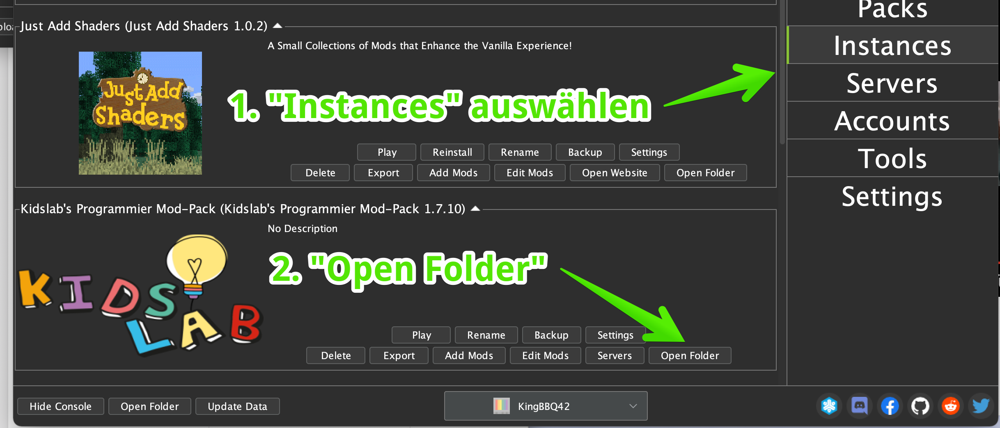
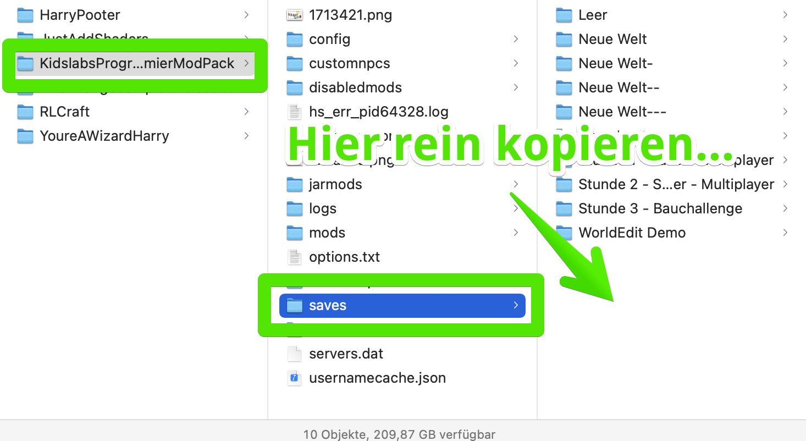

# Welten verwalten

Die einzelnen Welten oder abgespeicherten Spiele sind jeweils ein Ordner auf deiner Festplatte. Um den Ordner zu öffnen, ist es am einfachsten, erst mal AtLauncher zu öffnen.

Dort findest Du unter **Instances** bei dem entsprechenden ModPack - KidsLab in unserem Fall - einen Knopf "**Open Folder**" - da bitte drauf klickern.

Das öffnet ein Fenster - Explorer im Fall von Windows, oder wie hier eben - den Finder.

Hier findest du ein Unterverzeichnis names "saves". Klick da mal drauf bitte! Hier findest du alle abgespeicherten Spiele. Hier bitte die ZIP-Datei kopieren und entpacken.


Fertig! Du hast es geschafft! Beim nächsten Start des KidsLab-ModPacks findest du die neue Welt unter **Einzelspieler**


