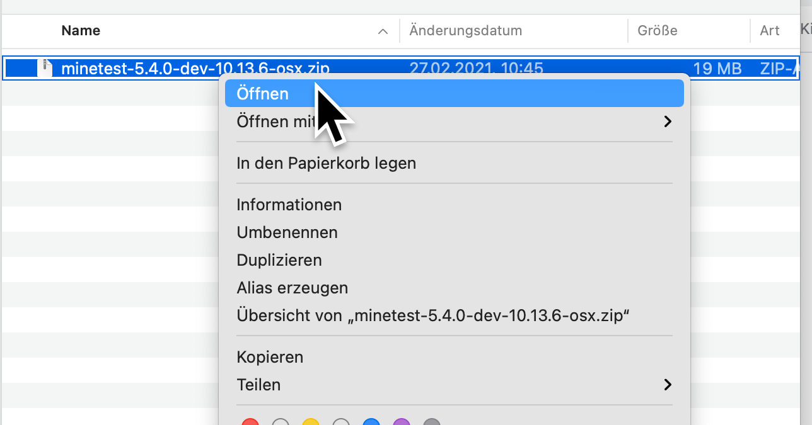
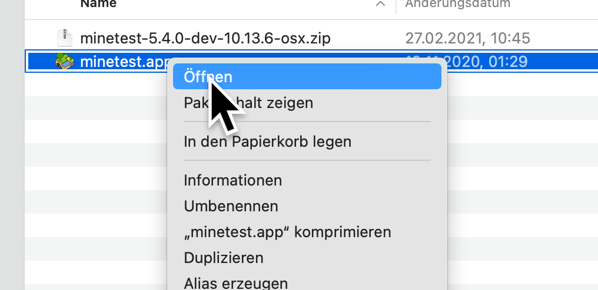
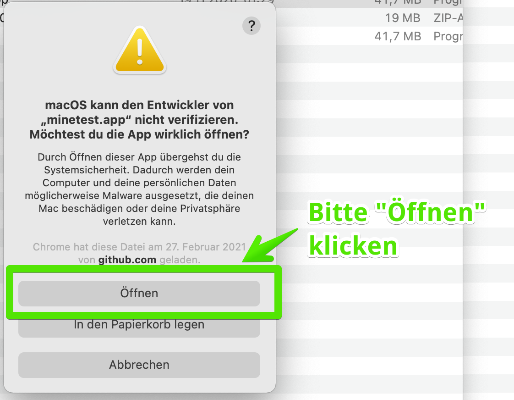

# Installation \(Mac\)

Die aktuelle Version kann auf dieser Seite heruntergeladen werden:



Nachdem der Download abgeschlossen wurde, liegt die Datei im "Downloads" Ordner.

Mit einem Doppelklick oder Rechtsklick und "Öffnen" wird das Programm entpackt.

Zum Starten des Programms muss man einmalig mit einem Rechts-Klick und "Öffnen" das Programm starten:

Dann erhält man diese Warnung - und muss bestätigen, dass man das Programm öffnen will:

Jetzt kann man zum Schluss das Programm noch in den Ordner "Programme" verschieben.


Super, geschafft! Minetest ist installiert und es kann losgehen!


