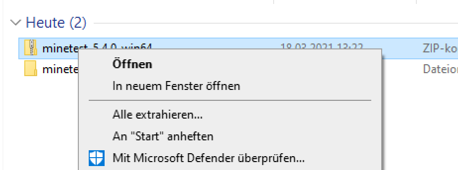
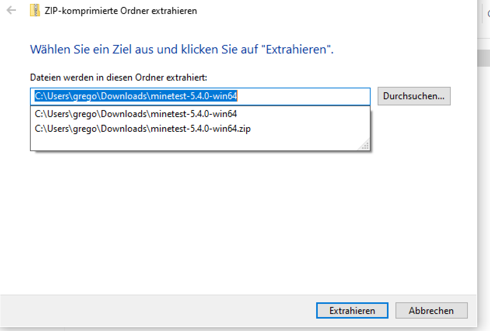
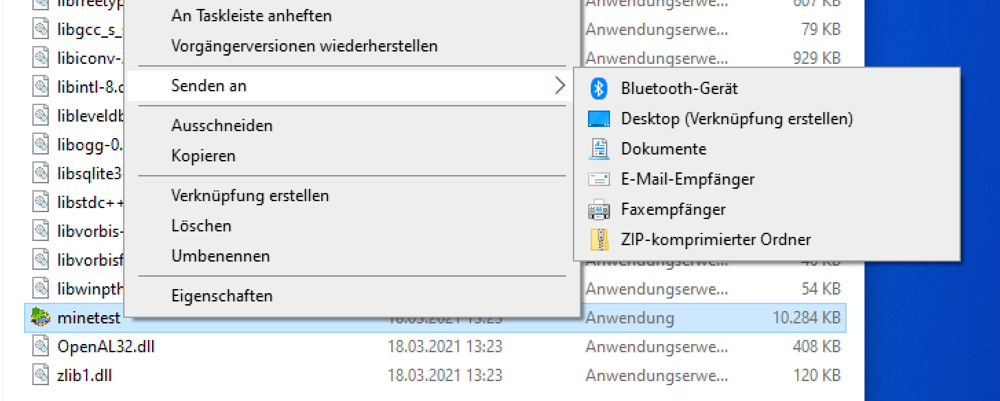
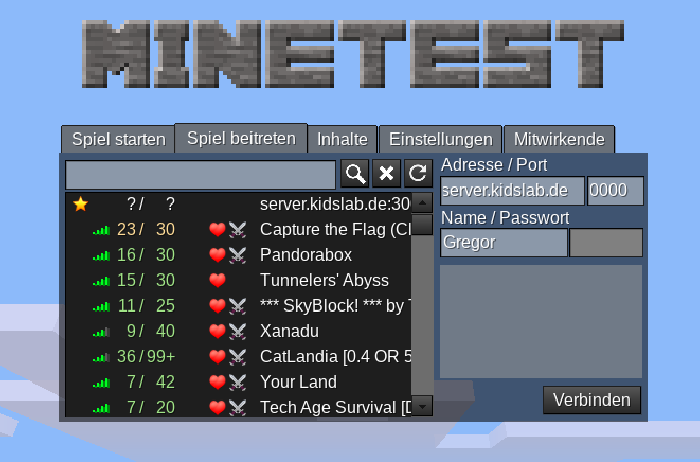

# Installation \(Windows\)

## Minetest - Installation

Minetest ist **kostenlos** und schnell installiert.

### So geht's \(Windows\)

* Klicke auf diesen Link zum runterladen: [Minetest Download](https://github.com/minetest/minetest/releases/download/5.4.0/minetest-5.4.0-win64.zip)
* Die Datei wird unter "Downloads" gespeichert.
* Klicke mit der rechten Maustaste auf die Datei - wähle "Alle extrahieren..."
  * 
* Nach mal auf "Extrahieren" klicken
  * 
* Gehe in der Ordner:
  * Dowloads...
  * Mintest.5.4.0.win64
  * * "../minetest.../bin/" wechseln
* Rechts auf "minetest" klicken -&gt; Senden an -&gt; Desktop \(Verknüpfung erstellen\)
  * 

Damit landet das Minetest-Icon auf dem Desktop. Mit Doppel-Klick starten und es geht schon los:

Adresse unseres Servers:

* server.kidslab.de
* Port: 30001
* Name: Dein Name :-\)

Auf Verbinden klicken - fertig!

Nicht wundern - du bist dann in einer mehr oder weniger leeren Welt!

Oder noch mal als kleines Video:



