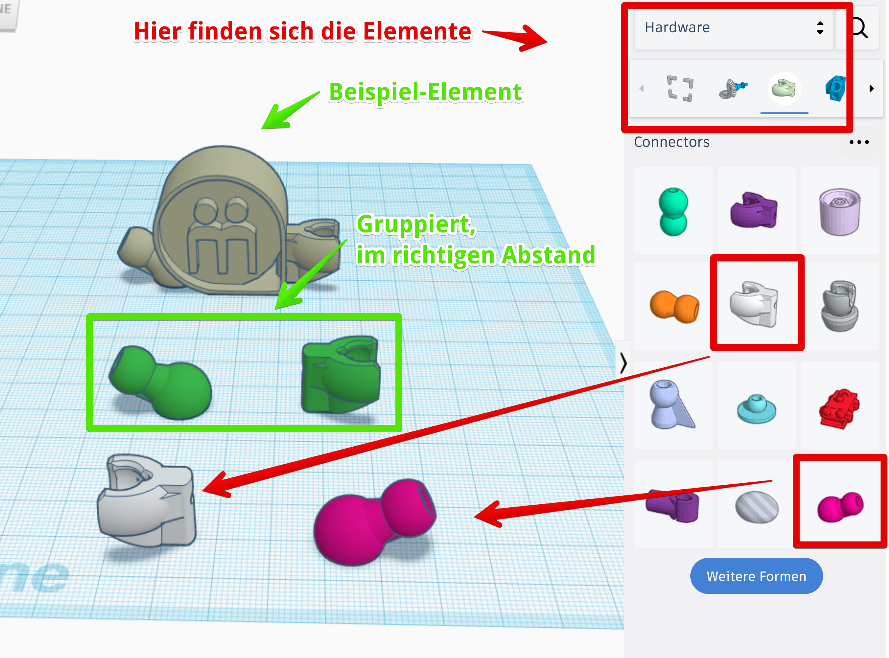
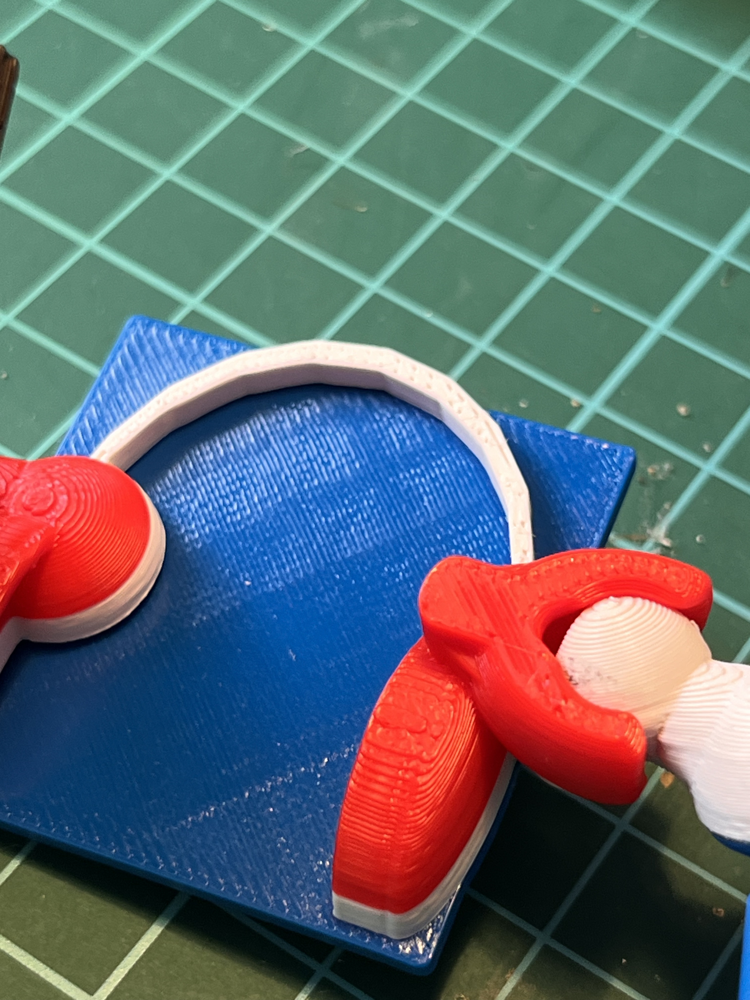
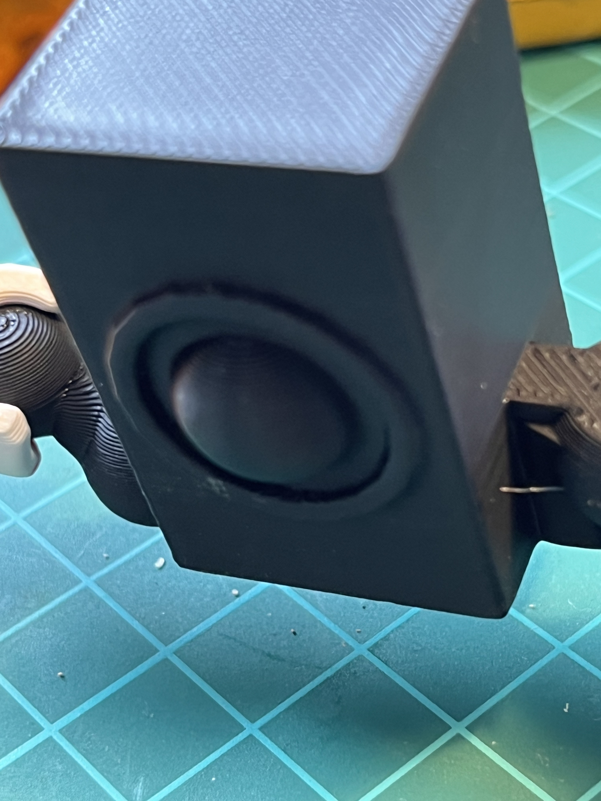
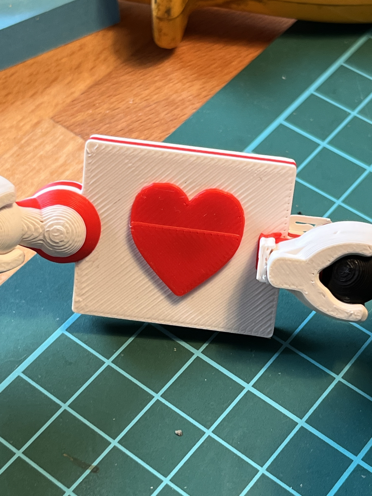
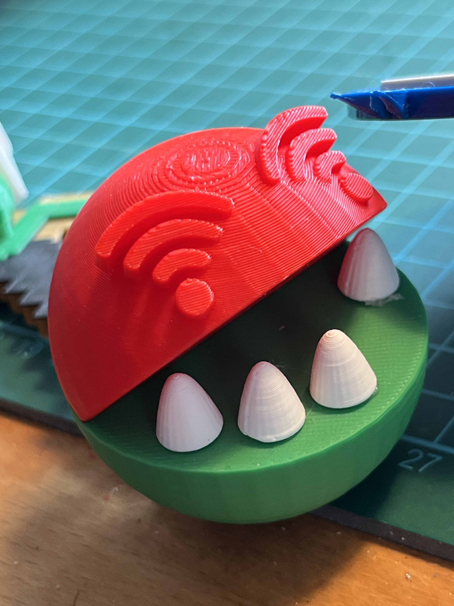
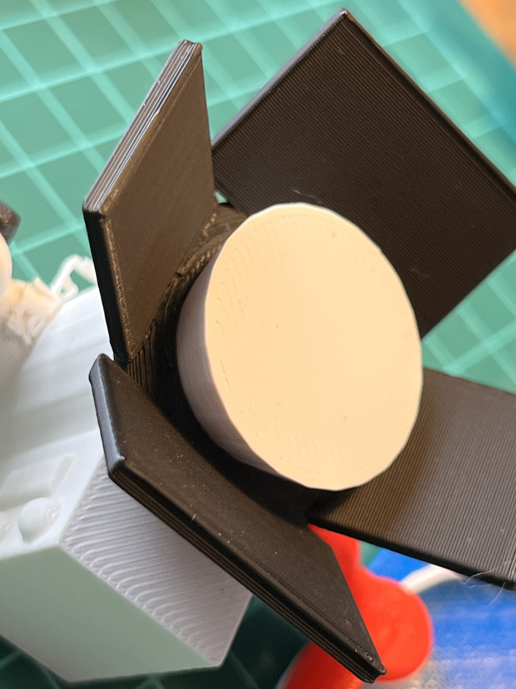

# 🐲 3D-Team-Drachen

Gemeinsam geht’s besser! Gemäß dieses Mottos möchte ich hier eine Idee vorstellen, wie aus vielen einzelnen 3D-Entwürfen ein großes gemeinsames Kunstwerk wird.

Die Idee entstand für einen Maker-Bereich auf einer kleinen [Messe](https://www.augsburg.de/umwelt-soziales/kinder-und-jugendliche/medienpaedagogik/augsburger-medienscouts/medienscouts-convention-2023): Kinder und Jugendliche sollten eine Einführung in 3D-Design und -Druck erhalten. Aber was könnte man entwerfen, was den gemeinsamen Charakter und die Idee der Messe trägt? Es wurde ein Fabeltier - der [MedienScout](https://www.augsburg.de/umwelt-soziales/kinder-und-jugendliche/medienpaedagogik/augsburger-medienscouts)-Drache.

## Vorbereitungen

Ich habe für den Workshop eine Klasse angelegt, da ich mit iPads gearbeitet habe, mit einem „Schüler“ für jedes iPad: so konnte auf allen iPads gleichzeitig gearbeitet werden und die Ergebnisse waren zentral in der Klasse verfügbar.

In der Klasse habe ich dann eine Vorlage erstellt und über die Funktion "[Aktivitäten](https://www.tinkercad.com/blog/introducing-tinkercad-activities)" mit der Klasse geteilt:

<figure><figcaption>
Vorlage in einer "Aktivität" hinterlegen
</figcaption></figure>

Die Vorlage besteht aus den jeweiligen Verbindern, mit denen man dann die einzelnen Elemente zusammenstecken kann:

<figure><figcaption>
Vorlage für Verbinder / einzelnes Element
</figcaption></figure>

### Vorlage für Verbinder

Die Vorlage, die ich genutzt habe, ist in TinkerCAD öffentlich verfügbar:&#x20;


Vorlage für das "Verbindende Element"


Ich habe die beiden Verbinder noch gruppiert, um so den Maßstab zu zeigen. Ein Beispiel-Element ist auch noch mit dabei, damit man abschätzen kann, wie groß das Ganze wird.

## Ablauf

1. Zuerst gibt es eine kleine Einführung in TinkerCAD. Das dauert pro Person / Gruppe ca. 5 Minuten.
2. Das Thema wird erklärt: in unserem Fall: _"Überleg Dir ein Symbol oder Gegenstand zum Thema Medien."_
3. Jeder Teilnehmer nimmt sich dann die Vorlage und kopiert diese dann bearbeitet
4. Am Ende sollen die Teilnehmer noch Ihren Namen und Ihre Schule als Namen des Elements eingeben

## Ergebnisse

Hier ein paar Beispiele - der Ausdruck wurde mit verschieden Farbschichten gemacht.


Beispiel Element - WLAN-Drachenkopf


<figure><figcaption>
Kopfhörer
</figcaption></figure>

 

<figure><figcaption>
Lautsprecher
</figcaption></figure>

 

<figure><figcaption>
I Like!
</figcaption></figure>

 

<figure><figcaption></figcaption></figure>

 

<figure><figcaption>
Scheinwerfer
</figcaption></figure>

