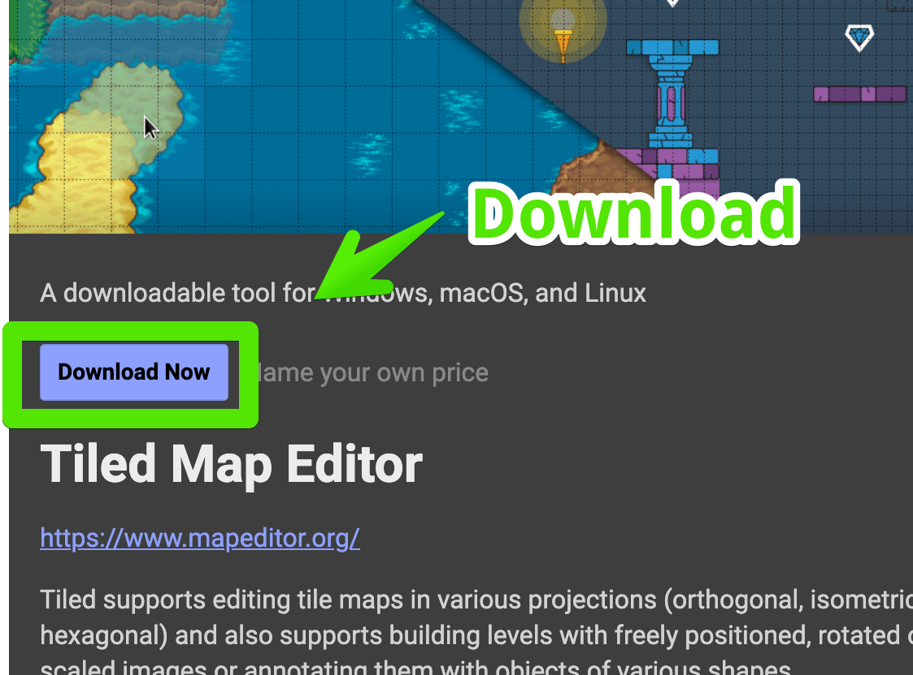

# WorkAdventure

Zum Installieren des Editors "Tiled" bitte auf folgende Seite gehen:



Klicke auf Download:

Der Download ist grundsätzlich kostenlos - wenn man möchte, kann man den Entwicklern auch noch was spenden :-)

Im nächsten Schritt kannst Du deine passende Plattform wählen und den Installer runterladen. Nach dem Runterladen kannst du die Datei mit einem Doppelklick öffnen.
